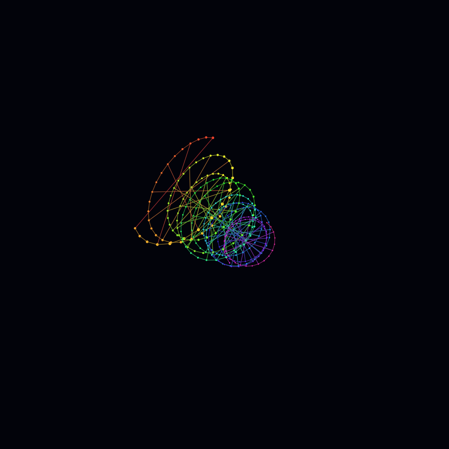

# 3D Hyper-Helix Grid Engine

以 Python 標準函式庫製作的霓虹雙股螺旋網格動畫。作品參考 Code Kadam 的彩虹幾何光點概念，重新加入 `3D` 透視投影、旋轉、呼吸脈衝與雙股網格連線。



## 本機執行

不需要安裝第三方套件。Windows 可直接雙擊 `run.bat`，或執行：

```powershell
python hyper_helix.py
```

動畫會持續循環。按下 `Esc` 鍵或關閉視窗即可離開。

## 匯出預覽

雙擊 `export_preview.bat`，或執行：

```powershell
python hyper_helix.py --export-svg preview.svg
```

## 核心檢查

```powershell
python hyper_helix.py --check
```

## 技術特色

- 雙股參數式螺旋與動態半徑。
- Yaw／Pitch 空間旋轉及透視投影。
- HSV 全色域霓虹漸層。
- 依景深排序的粒子繪製。
- 約 `30 FPS` 持續循環動畫。
- 純 `tkinter`，無第三方相依套件。

## 授權

MIT License
